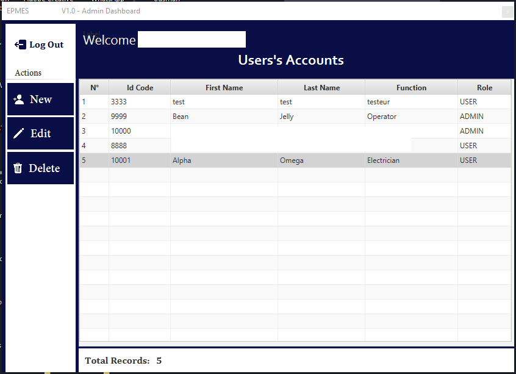
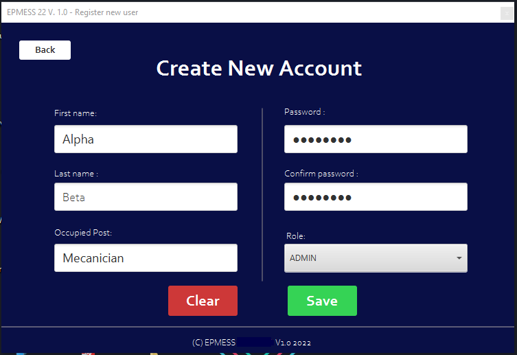

# A JavaFX Application as Computer-Assisted Maintenance Application, based on KPI(Key Performance Indicators).

## Description

This JavaFX Application is developped with th aim of:

* Visualize machines KPI(Key Performance Indicators) on graphs
* Predict faults on Machines
* Shedule maintenance operations on those machines

 
## Installation

* Follow this link [Java 8 JDK](https://www.oracle.com/java/technologies/downloads/#java8) to setup a Java 8 Environement on your computer.
* Follow this link [IntelliJ Idea](https://www.jetbrains.com/idea/download/#section=windows) to download the IDE (Integrated Development Environement) used in this project. Or download a different IDE such as Eclispe, Netbeans, etc. 
* Afterwards, add the JavaFX Plugin in your IDE.

## How to run project.

* Clone the Github project at [This Repository](https://github.com/Nouhou47/EPMES22.git) on your machine.
* Add [My SQL Connector Driver](https://jar-download.com/artifacts/mysql/mysql-connector-java) to connect the Java App to a PySQL Database.
* Run the project in your IDE.

## User's Interfaces (UI) Screenshoots.

### App Logo.

### Launch

### Login 

## Admin Interfaces

### Dashboard

### New Admin

## Operator's Interfaces

### Dashboard

### Check-up datas Graphs.

### Check-up datas Records.

### KPI - Reliability, Maintenability & Tresholds values.

### Faults datas Records for a choosen Equipement.

### New Fault Data Record.

### New Check-up Data Record.

## Contributing

Pull requests are welcome. For major changes, please open an issue first and discuss what you would like to change.
